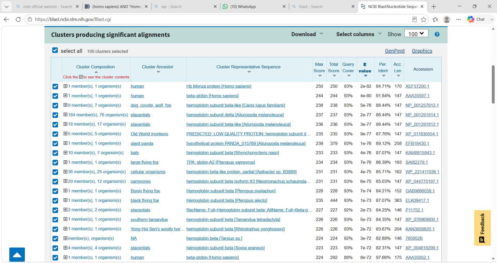

# 02 - BLAST Sequence Alignment

This module covers local sequence alignment and homology search using BLAST.

### What I did
- Performed BLASTn, BLASTp and BLASTx for different query sequences
- Analyzed BLAST results based on E-value, percent identity, and query coverage
- Understood how to find homologous sequences for unknown queries

### Tools Used
- NCBI BLAST

### Skills Gained
Practical understanding of using BLAST for similarity search and interpreting alignment results. 

# 02 - BLAST Sequence Alignment

## Q1. BLASTN - Nucleotide Sequence Analysis
**Result:** [yaha 2 line me result likh dena]

## Q2. BLASTP - Protein Sequence Analysis
**Result:**

## Q3. BLASTX - Protein Sequence Analysis

## Q4. tBLASTn - HBB Gene

## Q5. TBLASTN - TP53
