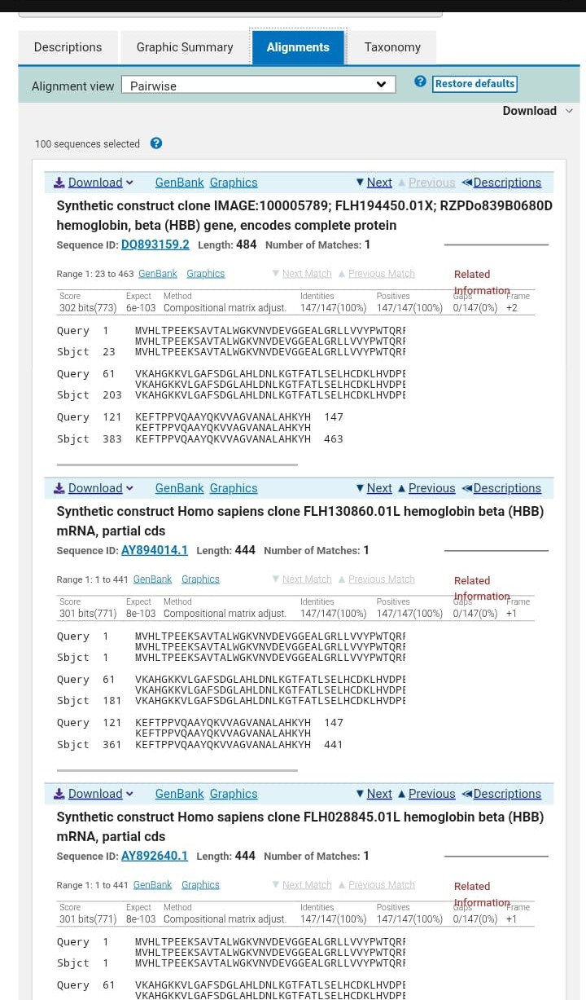

# 02 - BLAST Sequence Alignment

This module covers local sequence alignment and homology search using BLAST.

### What I did
- Performed BLASTn, BLASTp and BLASTx for different query sequences
- Analyzed BLAST results based on E-value, percent identity, and query coverage
- Understood how to find homologous sequences for unknown queries

### Tools Used
- NCBI BLAST

### Skills Gained
Practical understanding of using BLAST for similarity search and interpreting alignment results. 

# 02 - BLAST Sequence Alignment

#### 1. BLASTX - Protein Sequence Analysis

#### 2. tBLASTn - Hemoglobin Beta HBB

#### 3. TBLASTN - TP53 Tumor Suppressor

#### 4. BLASTN - Nucleotide Sequence

#### 5. BLASTP - Protein Sequence
