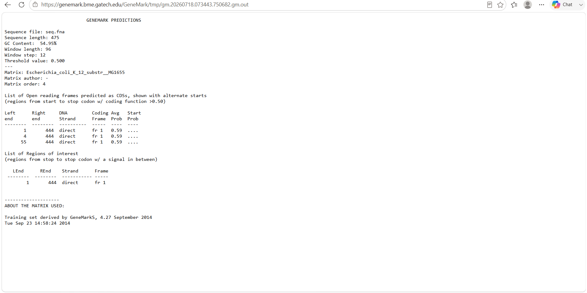
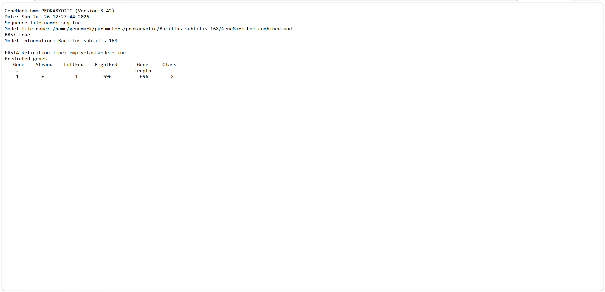
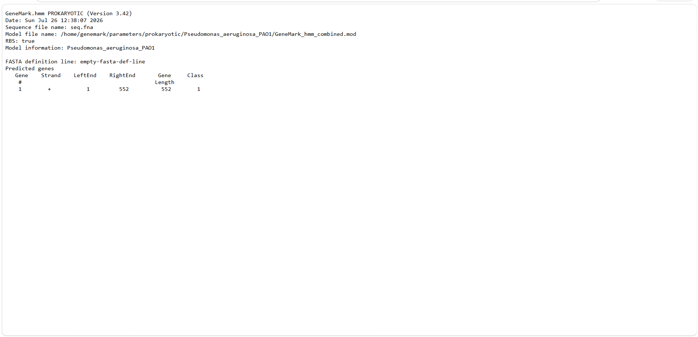
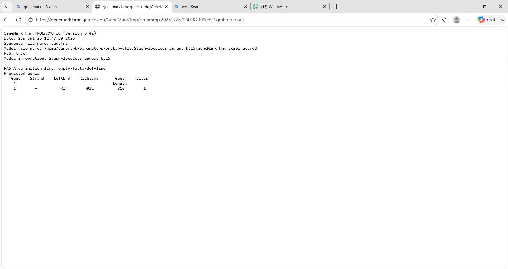

# 03 - Gene Prediction using GeneMark

This module deals with computational gene prediction in prokaryotic and eukaryotic genomes.

### What I did
- Used GeneMark and GeneMark.hmm for gene prediction
- Practiced identifying coding regions and understanding prediction output
- Compared predictions for prokaryotic vs eukaryotic sequences

### Tools Used
- GeneMark, GeneMark.hmm

### Skills Gained
Basic understanding of gene prediction workflow and analysis of predicted gene structures.

### GeneMark Prediction Results

#### Q1. ORF Identification - 42

#### Q2. Start-Stop Codon - 475bp

#### Q3. Number of Genes

#### Q4. Pseudomonas Analysis

#### Q5. Strand Orientation

